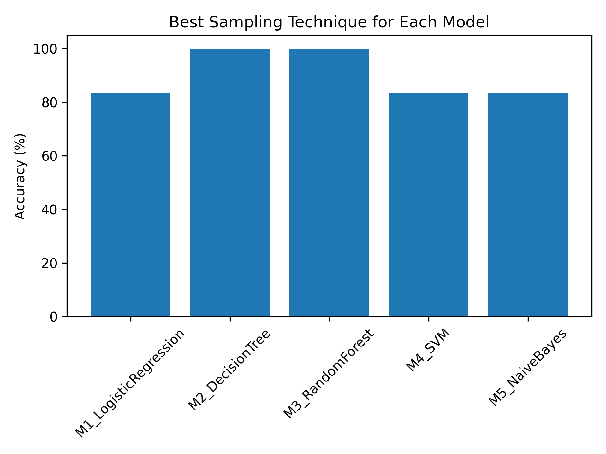

# Sampling Techniques on Imbalanced Dataset

**Author:** Saumya Kumari  
**Roll No:** 102303161 

---

## 📌 Objective
The objective of this assignment is to understand the importance of different sampling techniques in handling highly imbalanced datasets and to analyze how these techniques affect the performance of various machine learning models. The study evaluates and compares multiple sampling strategies across different classifiers using accuracy as the evaluation metric.

---

## 📊 Dataset
- **Dataset Name:** Creditcard_data.csv  
- **Description:** The dataset represents a highly imbalanced credit card transaction dataset where one class significantly dominates the other.  
- **Dataset Link:**  
  https://github.com/AnjulaMehto/Sampling_Assignment/blob/main/Creditcard_data.csv

---

## 📁 Project Structure
- `assignment_sampling.ipynb` – Google Colab notebook containing data balancing, sampling techniques, model training, and evaluation
- `Creditcard_data.csv` – Imbalanced credit card transaction dataset used for experimentation
- `sampling_vs_models_accuracy.csv` – Accuracy results of all models across different sampling techniques
- `best_sampling_per_model.png` – Visualization showing the best sampling technique for each model
- `README.md` – Project documentation and results summary

---

## 🧪 Methodology

1. **Data Loading**
   - The dataset was loaded using Pandas.
   - Class distribution was analyzed to confirm imbalance.

2. **Data Balancing**
   - Undersampling was applied to convert the dataset into a balanced class dataset.

3. **Sampling Techniques Applied**
   - **Sampling1:** Simple Random Sampling  
   - **Sampling2:** Bootstrap Sampling  
   - **Sampling3:** Cluster Sampling  
   - **Sampling4:** Stratified Sampling  
   - **Sampling5:** Systematic Sampling  

4. **Machine Learning Models Used**
   - **M1:** Logistic Regression  
   - **M2:** Decision Tree  
   - **M3:** Random Forest  
   - **M4:** Support Vector Machine (SVM)  
   - **M5:** Naive Bayes  

5. **Evaluation Metric**
   - Accuracy (%) was used to compare model performance across different sampling techniques.

---

## 📈 Result Table

| Model | Sampling1 SimpleRandom | Sampling2 Bootstrap | Sampling3 Cluster | Sampling4 Stratified | Sampling5 Systematic |
|------|---------------------------|------------------------|----------------------|-------------------------|--------------------------|
| M1 – Logistic Regression | 33.33 | 83.33 | 50.00 | 16.67 | 66.67 |
| M2 – Decision Tree | 66.67 | 100.00 | 100.00 | 83.33 | 33.33 |
| M3 – Random Forest | 66.67 | 83.33 | 75.00 | 50.00 | 100.00 |
| M4 – SVM | 50.00 | 83.33 | 0.00 | 16.67 | 66.67 |
| M5 – Naive Bayes | 50.00 | 83.33 | 50.00 | 66.67 | 66.67 |

---

## 📊 Result Visualization

The following graph shows the **best sampling technique for each machine learning model** based on accuracy.

### 🔹 Best Sampling Technique per Model

---

## ⚠️ Constraints
- Results may vary slightly due to randomness in sampling methods.
- Some sampling techniques may not perform well if class distribution is not preserved.
- Accuracy alone may not fully capture model performance on imbalanced datasets.

---

## ✅ Conclusion
The experiment demonstrates that there is no single best sampling technique for all models. Bootstrap sampling performed consistently well across most classifiers, while Random Forest achieved the highest accuracy with systematic sampling. This highlights the importance of choosing an appropriate sampling strategy based on the model and data characteristics when working with imbalanced datasets.

---

